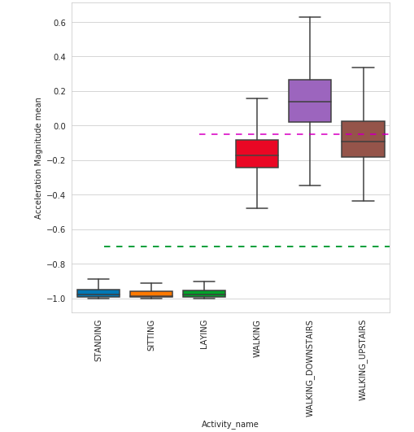
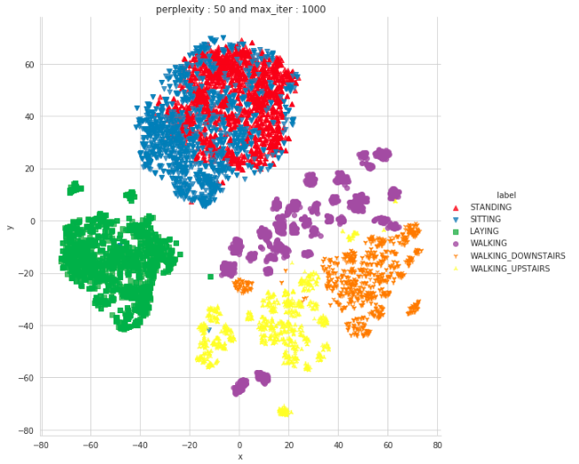
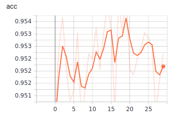
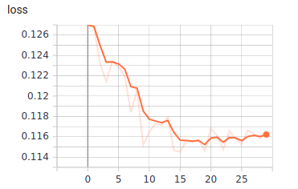

## HAR using Classical Machine Learning models and LSTM models.
This dataset consists about 30 humans activities classfied into 6 labels.It contains the time series data and textual data.
### Dataset Link:
https://archive.ics.uci.edu/ml/datasets/human+activity+recognition+using+smartphones<br>
#### Models used in Human Activity Recognition:
```
(1) LSTM Model
(2) Logistic regression with GridSearch
(3) Linear SVM with GridSearch
(4) Kernal SVM with GridSearch
(5) Random Forest with GridSearch
```
#### Some Basic Libraries
``` python
import pandas as pd
import numpy as np
import seaborn as sns
import matplotlib.pyplot as plt
import numpy as np
import datetime
%matplotlib inline


from sklearn.model_selection import train_test_split
from sklearn.metrics import accuracy_score, Confusion_matrix, Classification_report
from sklearn.manifold import TSNE

from keras import backend as K
import tensorflow as tf
from keras.models import Sequential
from keras.layers import LSTM
from keras.layers.core import Dense, Dropout
from keras.callbacks import ModelCheckpoint, ReduceLROnPlateau, TensorBoard

```
#### Plotting data
##### Box and whisker Plot
```
plt.figure(figsize=(7,7))
sns.boxplot(x='Activity_name', y='201 tBodyAccMagmean',data=train, showfliers=False, saturation=1)
plt.ylabel('Acceleration Magnitude mean')
plt.axhline(y=-0.7, xmin=0.1, xmax=1.0,dashes=(5,5), c='g')
plt.axhline(y=-0.05, xmin=0.4, xmax = 1.0,dashes=(5,5), c='m')
plt.xticks(rotation=90)
plt.show()
```

##### T-SNE
In Notebook HAR_EDA T-SNE is plotted using different perplexities but here it is shown with 50 only.
```
X_tsne = train.drop(['subject', 'Activites','Activity_name'], axis=1)
y_tsne = train['Activity_name']
tsne(X_data = X_tsne,y_data=y_tsne, perplexities =[5,10,20,50])
```

#### Accuracy
In case of the classical Machine Learning Algortihms the Linear SVM Acuracy on test set was at the top most.
```
Linear Regression - Accuracy on test set 0.9623345775364778
Linear SVM        - Accuracy on test set: 0.9670851713607058
Kernal SVM        - Accuracy on test set:  0.9626739056667798
Random Forest     - Accuracy on the test set:  0.9250084832032576
```
Accuracy is measured after some hyperparameter tunning on these algorithms.

##### LSTM
```
The hidden units used are 64, 32.
# Initiliazing the sequential model
model = Sequential()
# Configuring the parameters
model.add(LSTM(n_hidden, input_shape=(timesteps, input_dim)))
# Adding a dropout layer
model.add(Dropout(0.3))
# Adding a dense output layer with sigmoid activation
model.add(Dense(n_classes, activation='softmax'))
model.summary()
```
##### Keras callabcks
```
from keras.callbacks import ModelCheckpoint, ReduceLROnPlateau, TensorBoard, EarlyStopping
filepath="/content/gdrive/My Drive/Datasets/lstm3.hdf5"
log_dir="/content/logs/fit" + datetime.datetime.now().strftime("%Y%m%d-%H%M%S")
tensorboard_callback = TensorBoard(log_dir=log_dir, histogram_freq=1)
reduce_on_plateau = ReduceLROnPlateau(monitor="val_loss", mode="min", factor=0.1, patience=4, verbose=1)
checkpoint = ModelCheckpoint(filepath, monitor='val_loss',save_best_only=True, verbose=1)
early_stopping = EarlyStopping( monitor='val_loss',patience=10,verbose=1,restore_best_weights=True)
callbacks_list = [checkpoint, reduce_on_plateau, tensorboard_callback, early_stopping ]
```
##### Tensorboard Visualisation



#### Model accuracy on 64 hidden layers
```
2947/2947 [==============================] - 6s 2ms/step
90.36308109942314

Accuracy was decreased while increasing the layers due to the less number of the parameters.
```
